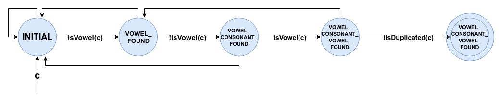
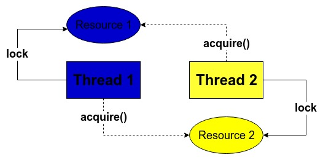

# java_exercises

## Exercícios 1 e 2

1)  Para este exercício, assumir que todo campo de data deve estar no formato 
'dd-MM-yyyy'.

2)  Todas as campanhas e clientes estão sendo mantidos em memória, dentro dos controllers correspondentes (CampaignController e PartnerController)

2)  #### API para campanhas
    
    1) <b>GET /prova-java/campaigns/{id}</b>
    
        Retorna campanha definida pelo {id}.
    
        Se a campanha não estiver cadastrada, retorna mensagem explicativa.  

    2) <b>POST /prova-java/campaigns/add</b>
    
        Segue exemplo do conteúdo/body dessa chamada
    
            Request Body:
            {
            	"team_id": 10,
            	"name": "third",
            	"start_date": "01-01-2019",
            	"end_date": "03-05-2019"
            }
        
        Retorna a nova campanha adicionada.
        
        Se a campanha já existir, retorna mensagem explicativa.

    3)  <b>GET /prova-java/campaigns/allActive</b>
    
        Retorna todas as campanhas ativas na data atual.
        
    4)  <b>PUT /prova-java/campaigns/update/{id}</b>

        Retorna a campanha com seus campos atualizados. Segue exemplo de formato dos parâmetros:
        
            http://localhost:8080/prova-java/campaigns/update/3?team_id=4&name=newName
        
        Se a campanha não estiver cadastrada, retorna mensagem explicativa.  
        
    5)  <b>DELETE /prova-java/campaigns/delete/{id}</b>
        
        Exclui a campanha definida por {id} e retorna mensagem explicativa.
                
        Se a campanha não estiver cadastrada, retorna mensagem explicativa.  

3)  #### API para clientes

    1) <b>GET /prova-java/partners/{id}</b>
    
        Retorna o cliente já cadastrado.
        
        Se o cliente não estiver cadastrado, retorna mensagem explicativa.    
    
    1) <b>GET /prova-java/partners/{id}/campaigns</b>
    
        Retorna campanhas associadas ao cliente  definido por {id}.
    
        Se o cliente não estiver cadastrado, retorna mensagem explicativa.  

    2) <b>POST /prova-java/partners/add</b>
    
        Segue exemplo do conteúdo/body dessa chamada
    
            Request Body:
            {
            	"team_id": 10,
            	"full_name": "Full Name",
            	"email": "full.name@gmail.com",
            	"birth_date": "01-01-2000"
            }
        
        Se o cliente já tem cadastro, e tem campanhas ativas associadas, retorna tais campanhas;
        
        Se o cliente não tem cadastro ou já possui mas não tem campanhas associadas, retorna as novas campanhas ativas do seu time do coração para associação;
    
    3)  <b>GET /prova-java/partners/{id}/new</b>
    
        Retorna todas as novas campanhas ativas na data atual para o time do coração do cliente {id}.
       
    3)  <b>POST /prova-java/partners/{id}/join</b>
           
        Associa cliente às novas campanhas ativas para seu time do coração e retorna todas as novas campanhas associadas.
               
    4)  <b>PUT /prova-java/partners/update/{id}</b>

        Retorna a campanha com seus campos atualizados. Segue exemplo de formato dos parâmetros:
        
            http://localhost:8080/prova-java/campaigns/update/3?team_id=4&name=newName
        
        Se a campanha não estiver cadastrada, retorna mensagem explicativa.  
        
    5)  <b>DELETE /prova-java/campaigns/delete/{id}</b>
        
        Exclui a campanha definida por {id} e retorna mensagem explicativa.
                
        Se a campanha não estiver cadastrada, retorna mensagem explicativa.  

   Período de vigência:
Caso a data de término de uma campanha seja menor que a data de fim de um período e maior que a data de início de um período, então essa campanha está em <b>vigência</b> para este período.

## Exercício 3

1) Para testar esta solução para utilizar o método StreamReader.printSpecialCharacter passando como parêmetro uma String de entrada.

2) Se a Stream tiver uma cadeia vazia, ou então o fim da string for atingido, o retorno de getNext() será o char Character.MIN_VALUE

2) Esta solução foi feita a partir da máquina de estados ilustrada abaixo.

    

2) A primeira dúvida que me surgiu ao ler o enunciado foi: "o propósito do exercício é que eu implemente os métodos getNext(), hasNext() e firstChar() da interface Stream criada manualmente sem utilizar a API stream (java.util.stream), correto?"

    Para minha pergunta foi respondido que obrigatoriamente os 3 métodos deveriam ser implementados da forma que eu achasse melhor, sem me confundir com o stream do java 8.
    Dessa forma, estou assumindo que não devo utilizar a estrutura Stream do java 8.

## Exercício 4

<b>O que é Deadlock? Detalhe um pouco sobre o caso e como você poderia
resolver isso.</b>

O deadlock é um cenário em que um sistema se encontra bloqueado pois todos seus componentes estão aguardando algum retorno de um outro componente, que, por sua vez, também encontra-se em estado de espera.  

Exemplo 1: deadlock irá ocorrer se uma thread que já está com lock de um mutex tentar obter outro lock neste mesmo mutex, pois entrará em modo de espera e não liberará nunca o primeiro lock.

Exemplo 2: quando duas threads estão ambas se aguardando liberarem algum recurso que necessitam, entram em um estado de bloqueio infinito, portanto deadlock. A figura abaixo ilustra este cenário, em que duas threads estão paradas em estado de espera.

Um forma de se remediar deadlocks é através da configuração de timeouts, o que evitaria que um recurso seja alocado por tempo indeterminado.

A forma mais eficaz de se evitar deadlocks é não utilizar locks aninhados, ou seja, um método não deve pedir o lock de um recurso quando já possui lock para um outro recurso. Se múltiplos locks forem necessários, devem ser agrupados em um lock único que bloqueia todos os recursos antes de se iniciar essa cadeia de solicitações.

## Exercise 5

<b>Uma das grandes inclusões no Java 8 foi a API Stream. Com ela podemos
fazer diversas operações de loop, filtros, maps, etc. Porém, existe uma
variação bem interessante do Stream que é ParallelStreams. Descreva com
suas palavras quando qual é a diferença entre os dois e quando devemos
utilizar cada um deles.</b>

A Stream é uma estrutura que comporta uma sequência de elementos e suporta 
funções de agregação. Uma stream pode ser a analogia de uma lista infinita.
Esta API permite que os desenvolvedores trabalhem com um conjunto de elementos de 
forma mais simples e com um número menor de linhas de código.

Esta mesma API ainda obtém vantagem sobre arquiteturas multi-core ao permitir paralelizar
o processamento dos elementos. Para isso, devemos utilizar a estrutura ParallelStreams, que consegue 
organizar o processamento de substreams em threads separadas.

Em casos em que a ordem dos elementos do resultado de uma operação com o stream pode ser 
ignorada, ou então processamento de coleções muito grandes, é interessante considerar
a utilização de ParallelStreams para aumentar a performance de uma operação.

Porém o fato de ParallelStreams utilizar diferentes threads, que representam dados, para streams faz com que
exista um overhead de espaço de memória quando comparamos com o Stream, que é sequencial. Além disso,
se um recurso utilizado nos predicados ou funções for compartilhado, 
o desenvolvedor deverá garantir segurança na execução das threads, o que gera maior 
complexidade ao código.

>>>>>>> master
